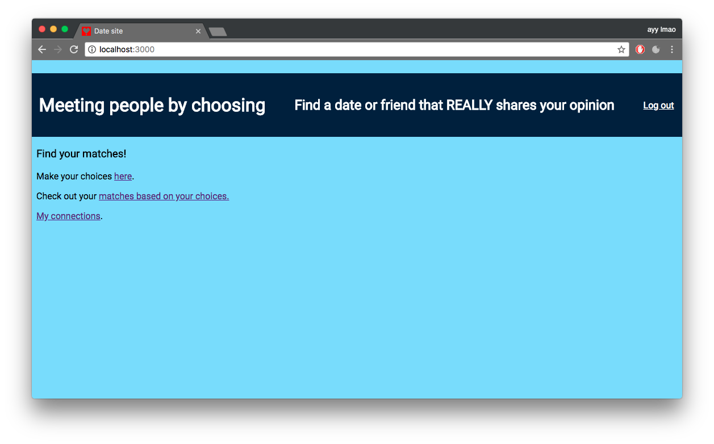

# Matching by choices


This application lets you find likeminded people by comparing your answer to a set of questions to theirs.

## Using this application

First clone this repository, then use ```npm install``` in the be-assessment-2 directory to install the dependencies.
When the app is installed start it using ```npm start```.
To use nodemon the script ```npm run devstart``` is used.
You can then launch your browser and navigate to ```localhost:3000``` to use the application.

The first logical step here is to create an account and log in.
After that you'll be able to pick between 3 choices and find out your who your soulmate is.

## Functionality

- [x] Registering a new user in database
- [x] Password hashing using bcrypt
- [x] Login
- [x] Staying logged in using express-sessions
- [x] Choosing between 3 options
- [x] See who you match with based on those choices
- [x] Edit your choices and find new matches
- [x] Connecting to your matches
- [x] Deleting connections

## Things I would have liked to add if I had more time

- [ ] System to upload profile pictures
- [ ] Styling of the whole application, unfortunately I had to spend too much time making sure it even works
- [ ] More filter options to your matches
- [ ] The ability to be able to see 'near matches' instead of just people with exactly the same 3 choices
- [ ] Changing more aspects of your profile than just the choices
- [ ] Sanitizing form data
- [ ] When editing choices, have the current choices pre- filled in in the form

## Some important things I used

- **nodejs** - runtime which was a prerequisite for the course.
- **express (and express-generator)** - express was a prerequisite, and express-generator produced the core structure and code for the project .
- **mongoose / mongodb (storage on mlab)** - First of all I used mongodb because it's less strict in its usage than SQL. Also since I was already somewhat familiar with json I figured it'd be easier for me to work with. On top of that I used mongoose, because of my familiarity with JavaScript. Using mongoose felt more like working with objects to me and that made it more intuitive to use.
Last of all I used mlab so I could use this application without a locally stored database, which made it easy to test for other people without having them install a local database and add my pre-existing users.
- **bcrypt** - used for hashing the passwords stored on mlab

## Structure


source: <https://en.wikipedia.org/wiki/Model%E2%80%93view%E2%80%93controller>

For this project I used a **model/view/controller** structure (or at least tried to).

I'd say the model consists of ```app.js``` in the home directory and ```routes/routes.js```. The second one of those two mainly updates the views which are located in the ```/views``` directory. ```routes.js``` controls most requests and responses of the application. In the ```routes.js``` file some controllers are called upon. These are ```authentication.js```, ```choices.js``` and ```matches.js```. I tried to keep the bigger functions separated in those three controllers to help my code stay more organised.

Although in the future I would likely be able to execute this a lot better, I felt like the structure of my project still helped me maintain (more) overview.

## These were a big help, and without them I wouldn't have finished this project

- <https://github.com/cmda-be/course-17-18>
- <https://zellwk.com/blog/crud-express-mongodb/>
- <http://mherman.org/blog/2014/12/31/node-and-mongoose-a-primer/>
- <https://glebbahmutov.com/blog/express-sessions/>
- <https://codeforgeek.com/2014/09/manage-session-using-node-js-express-4/>
- <https://medium.com/of-all-things-tech-progress/starting-with-authentication-a-tutorial-with-node-js-and-mongodb-25d524ca0359>

## Author
Joost Flick, who (at the time of creating this application) is a second year student doing the Backend course at the study Communication and Multimedia Design.
